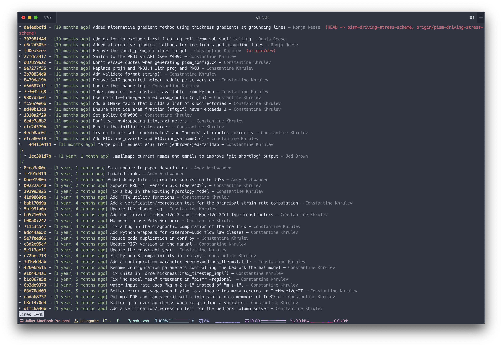

# Dotfiles
This repository contains my [dotfiles](https://wiki.archlinux.org/index.php/Dotfiles).

## Contents
- `.jupyter/custom/custom.css`: Configuration file for [Jupyter Notebooks](https://jupyter.org). Mainly adds custom colors and some font styles.
- `.bash_aliases`: Contains all bash alias definitions.
- `.bashrc`: General configuration file for the Bash Shell. Prepares environment to use [Environment Modules](http://modules.sourceforge.net) and sets various environment variables as well as some custom stuff.
- `.kshrc`: Configuration file for the [KornShell](http://www.kornshell.org).
- `.ncviewrc`: Configuration file for [Ncview](http://meteora.ucsd.edu/~pierce/ncview_home_page.html).
- `.vimrc`: Configuration file for [Vim](https://www.vim.org). I'm using [vim-plug](https://github.com/junegunn/vim-plug), e.g. for the [Nord](https://www.nordtheme.com/ports/vim) color scheme.
- `.xinitrc`: Configuration file for the initialization of the [X Server](https://www.x.org/).
- `.Xresources`: Configuration file for the [X Window System](https://www.x.org/). Also adds some UI customization for *Ncview*.
- `.zshrc`: Configuration file for [Oh My Zsh](https://ohmyz.sh). Loads custom theme, aliases, functions and more. The [agnoster](https://github.com/agnoster/agnoster-zsh-theme) theme requires [Powerline Fonts](https://github.com/powerline/fonts) to be installed in the terminal in order to render properly.

## ZSH
#### Prompt
ZSH is configured with the following prompt to indicate the current version control worktree status by changing its color:

Staged changes:


Unstaged changes:


For more capabilities of the ZSH agnoster theme and tips how to customize the prompt view, see [here](https://github.com/agnoster/agnoster-zsh-theme).

## Installing and managing dotfiles

> :warning: **WARNING:** These files contain code which affects the way your system behaves. **DO NOT** use blindly unless you know what that entails and only after reviewing the code. Use at your own risk! And always remember: with great power comes great responsibility. :point_up:

Before installation, make sure to back up already existing configuration files in your $HOME folder if you care about them, so they won't be overwritten by Git. To install, use the following commands (note, that this dotfile repository should be managed as a *bare Git repository*):
```
git clone --bare https://github.com/juliusgarbe/dotfiles.git $HOME/.cfg
git --git-dir=$HOME/.cfg/ --work-tree=$HOME checkout
```
Create an alias `config` which is used instead of the regular `git` command when interacting with the configuration repository:
```
alias config='/usr/bin/git --git-dir=$HOME/.cfg/ --work-tree=$HOME'
```
You might want to add the alias definition to your `.bashrc` (make sure to log out and log back in afterwards to be able to use it):
```
echo "alias config='/usr/bin/git --git-dir=$HOME/.cfg/ --work-tree=$HOME'" >> $HOME/.bashrc
```
Set a local flag to hide files that are not explicitly tracked:
```
config config --local status.showUntrackedFiles no
```
After successful execution of the setup any file within the $HOME folder can be version-controlled with normal commands, replacing `git` with the newly created `config` alias, e.g.:
```
config status
config add .bashrc
config commit -m "Add bashrc"
```
For more details, see [here](https://www.atlassian.com/git/tutorials/dotfiles).

## Git aliases
Although not included in this repository, I also use some aliases to make Git look prettier and more conventient. If you want, for example, a much prettier looking `git log`, just add the following alias to the global Git config file (`~/.gitconfig`) by copy-pasting this command into your terminal:
```
git config --global alias.logg "log --color --graph --pretty=format:'%C(bold yellow)%h%C(reset) - %C(green)[%cr]%C(reset) %s - %C(dim white)%an%C(reset) %C(bold red)%d%C(reset)' --abbrev-commit"
```
Now, using the alias `git logg` instead of `git log`, your commit history looks like this:


## Authorship
This repository is maintaned by [Julius Garbe](mailto:julius.garbe@pik-potsdam.de). Unless stated otherwise, the code is licensed under the [MIT License](LICENSE.txt).
