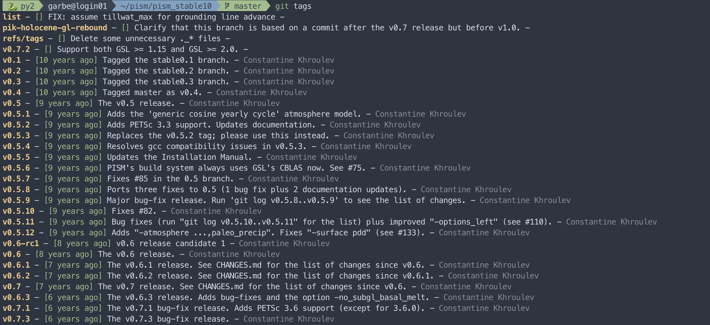

# Dotfiles
This repository contains my [dotfiles](https://wiki.archlinux.org/index.php/Dotfiles).

## Contents
- [`.app-defaults`](.app-defaults): Contains [X applications](https://www.x.org/) default resources.
- [`.bash/aliases.sh`](.bash/aliases.sh): Contains all personal bash alias definitions.
- [`.bash/functions.sh`](.bash/functions.sh): Contains all personal bash functions.
- [`.bash/prompt.sh`](.bash/prompt.sh): Customize appearance of shell prompt.
- [`.bash/variables.sh`](.bash/variables.sh): Contains personal environment variables.
- [`.bash_profile`](.bash_profile): General configuration file for the [Bash](https://www.gnu.org/software/bash/) login shell. Sets the preferred custom shell.
- [`.bashrc`](.bashrc): Configuration file for interactive non-login Bash shells. Loads aliases from `.bash/aliases.sh`, functions from `.bash/functions.sh`, and environment variables from `.bash/variables.sh`.
- [`.cdo/cdoCompletion.bash`](.cdo/cdoCompletion.bash): Definitions of CDO auto-completions for Bash.
- [`.cdo/cdoCompletion.zsh`](.cdo/cdoCompletion.zsh): Definitions of CDO auto-completions for ZSH.
- [`.condarc`](.condarc): Configuration file for the [Conda](https://docs.conda.io/en/latest/) Python package management system.
- [`.config/bat/config`](.config/bat/config): Configuration file for [Bat](https://github.com/sharkdp/bat).
- [`.config/matplotlib/matplotlibrc`](.config/matplotlib/matplotlibrc): Configuration file for [Matplotlib](https://matplotlib.org/index.html). See [here](https://matplotlib.org/stable/tutorials/introductory/customizing.html) for more information.
- [`.jupyter/custom/custom.css`](.jupyter/custom/custom.css): Configuration file for [Jupyter Notebooks](https://jupyter.org). Mainly adds custom UI colors and some font styles.
- [`.kshrc`](.kshrc): Configuration file for the [KornShell](http://www.kornshell.org). Not used.
- [`.ncmaps/ncmaps_myselection`](.ncmaps/ncmaps_myselection): Personal selection of [ncmaps](https://github.com/TomLav/ncmaps) color maps used for *Ncview*.
- [`.ncviewrc`](.ncviewrc): Configuration file for [Ncview](http://meteora.ucsd.edu/~pierce/ncview_home_page.html). I'm using [ncmaps](https://github.com/TomLav/ncmaps) to bring in and manage my favorite scientific color maps.
- [`.profile`](.profile): General configuration file for the Bash login shell. Only sourced if no `.bash_profile` is present. Currently empty, but custom environment variables might be defined here.
- [`.vimrc`](.vimrc): Configuration file for [Vim](https://www.vim.org). I'm using [vim-plug](https://github.com/junegunn/vim-plug), e.g. for the [Nord](https://www.nordtheme.com/ports/vim) color scheme and a [beautiful statusline](https://github.com/vim-airline/vim-airline).
- [`.xinitrc`](.xinitrc): Configuration file for the initialization of the [X Server](https://www.x.org/). Not used.
- [`.Xresources`](.Xresources): Configuration file for the [X Window System](https://www.x.org/). I'm using the pretty [Nord](https://github.com/arcticicestudio/nord-xresources) color theme. Also adds some UI customization for *Ncview*.
- [`.zshrc`](.zshrc): Configuration file for [Oh My Zsh](https://ohmyz.sh). Loads custom themes and plugins, as well as custom shell aliases, functions, environment variables, and more. The [agnoster](https://github.com/agnoster/agnoster-zsh-theme) theme requires [Powerline-patched Fonts](https://github.com/powerline/fonts) to be installed and a unicode-compatible terminal (I use [iTerm2](https://www.iterm2.com)) in order to render properly.

## ZSH
### Theme / prompt
ZSH is configured with the Agnoster theme which adds some more useful information to the prompt, e.g. it indicates the active conda environment as well as the current version control worktree status by changing its color:

*Unstaged changes:*


*Staged changes:*


*Clean worktree:*


For more capabilities of the Agnoster theme and tips how to customize the prompt view, see [here](https://github.com/agnoster/agnoster-zsh-theme).

### Fuzzy Finder
I'm using [FZF](https://github.com/junegunn/fzf). It's great. See yourself!


The FZF preview is configured to use [Bat](https://github.com/sharkdp/bat) for previewing files with syntax highlighting. I'm also using the pretty *Nord* theme here. For directories, the contents are listed with `ls`.

### Other OMZ plugins
#### Autosuggestions
Adds type-ahead [autocomplete suggestions](https://github.com/zsh-users/zsh-autosuggestions) based on the command history and completions:


#### Syntax highlighting
The [zsh-syntax-highlighting](https://github.com/zsh-users/zsh-syntax-highlighting) plugin makes commands turn green if typed right, red if not, while files & folders get underlined if existing.

## Vim
### Plugins
My plugins are managed through the [vim-plug](https://github.com/junegunn/vim-plug) Vim plugin manager. Below are some of the plugins I enjoy using:

#### Nord Vim
I'm using the beautiful [Nord](https://www.nordtheme.com/ports/vim) Vim color theme.

#### Statusline
The [vim-airline](https://github.com/vim-airline/vim-airline) plugin enables a nice and customizable statusline at the bottom of each Vim window:


#### Fuzzy Finder
Integrates [FZF](#fuzzy-finder) as a Vim plugin.

#### Indent Guides
The useful [vim-indent-guides](https://github.com/nathanaelkane/vim-indent-guides) plugin adds the functionality to visually display indent levels in Vim.

#### Gitgutter
The [vim-gitgutter](https://github.com/airblade/vim-gitgutter) plugin shows a git diff in the sign column, i.e. which lines have been added, modified, or removed.

#### Netrw
I'm using Vim's built-in file explorer. It's simple yet helpful.

### Mappings
Some convenient key mappings I use:

| Key | Mapping | Normal mode | Insert mode |
| --- | ------- | ----------- | ----------- |
| `Tab` `Tab` | Open [Fuzzy Finder](#fuzzy-finder) | :heavy_check_mark: | :heavy_minus_sign: |
| `e` | Toggle [Netrw](#netrw) browser | :heavy_check_mark: | :heavy_minus_sign: |
| `F1` | Toggle line numbers | :heavy_check_mark: | :heavy_check_mark: |
| `F2` | Toggle paste mode | :heavy_check_mark: | :heavy_check_mark: |
| `F3` | Toggle [vim-gitgutter](#gitgutter) | :heavy_check_mark: | :heavy_check_mark: |
| `F4` | Toggle invisible characters | :heavy_check_mark: | :heavy_check_mark: |
| `F5` | Toggle spell checking | :heavy_check_mark: | :heavy_check_mark: |

## Ncview
I use [Ncview](http://meteora.ucsd.edu/~pierce/ncview_home_page.html) extensively, so I like it to look pretty. In addition to using the [Nord](https://www.nordtheme.com) color theme, I also made a few UI tweaks (see [`.Xresources`](.Xresources)) and I use [ncmaps](https://github.com/TomLav/ncmaps) to add some nice scientific color maps. Below are two examples using color maps from [cmocean](https://matplotlib.org/cmocean/).


## Git aliases
Although not included in this repository, I also use some aliases to make Git look prettier and more convenient. If you want, for example, a much prettier looking `git log`, just add the following alias to the global Git config file (`~/.gitconfig`) by copy-pasting this command into your terminal:
```
git config --global alias.logg "log --color --graph --pretty=format:'%C(bold yellow)%h%C(reset) - %C(green)[%cr]%C(reset) %s - %C(dim white)%an%C(reset) %C(bold red)%d%C(reset)' --abbrev-commit"
```
Now, using the alias `git logg` instead of `git log`, your commit history looks like this:


Similarly, you can output a formatted and colored list of the tags using the following alias:
```
git config --global alias.tags "tag --sort=taggerdate --format='%(color:bold yellow)%(refname:short)%(color:reset) - %(color:green)[%(taggerdate:relative)]%(color:reset) %(subject) - %(color:dim white)%(taggername)%(color:reset)'"
```
The output of `git tags` will now look like this:



Another shortcut to make the `git branch` command more informative is to define the following alias:
```
git config --global alias.branches "branch -vv"
```
Using `git branches` instead of the usual `git branch` now also prints the SHA1 and subject line of each branch's HEAD, as well as the name of the upstream branch:


## Installing and managing dotfiles

> :warning: **WARNING:** These files contain code which affects the way your system behaves. **DO NOT** use blindly unless you know what that entails and only after reviewing the code. Use at your own risk! And always remember: with great power comes great responsibility. :point_up:

Before installation, make sure to back up already existing configuration files in your $HOME folder if you care about them, so they won't be overwritten by Git. To install, use the following commands (note, that this dotfile repository should be managed as a *bare Git repository*):
```
git clone --bare https://github.com/juliusgarbe/dotfiles.git $HOME/.cfg
git --git-dir=$HOME/.cfg/ --work-tree=$HOME checkout
```
Create an alias `config` which is used instead of the regular `git` command when interacting with the configuration repository:
```
alias config='/usr/bin/git --git-dir=$HOME/.cfg/ --work-tree=$HOME'
```
You might want to add the alias definition to your `.bashrc` (make sure to log out and log back in afterwards to be able to use it):
```
echo "alias config='/usr/bin/git --git-dir=$HOME/.cfg/ --work-tree=$HOME'" >> $HOME/.bashrc
```
Set a local flag to hide files that are not explicitly tracked:
```
config config --local status.showUntrackedFiles no
```
After successful execution of the setup any file within the $HOME folder can be version-controlled with normal commands, replacing `git` with the newly created `config` alias, e.g.:
```
config status
config add .bashrc
config commit -m "Add bashrc"
```
For more details, see [here](https://www.atlassian.com/git/tutorials/dotfiles).

## Authorship
This repository is maintained by [Julius Garbe](mailto:julius.garbe@pik-potsdam.de). Unless stated otherwise, the code is licensed under the [MIT License](LICENSE.txt).
